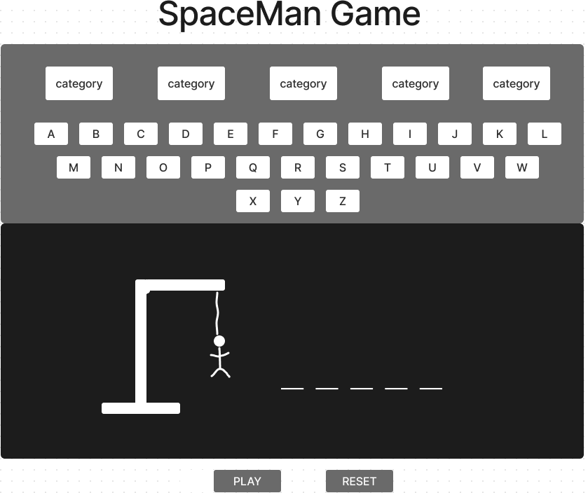

# Planning For Spaceman Game

## Analyzing the App's Functionality

### Minimal Viable Products

As a user/player, 

- I want to have the ability to select a category(animals, countries, etc).

- I want the game to have the ability to randomly select a word from the chosen category.

- I want the display of a blank spaces for each letter in the hidden word.

- I want to have the ability to guess letters by selecting them.

- I want to view the correct guessed letter in the right space in the word.

- I want the display of an incorrect guess count and a 'spaceman' figure that is progressively drawn as I make incorrect guesses.

- I want the game to end when I guess the word correctly or when I run out of guesses and the spaceman figure is complete.

- I want to have a scoring functionality that tracks the number of words guessed correctly.

- I want to have the ability to play again once the game is over

**If I have time these would be great**

Bonus user/player stories

- Multiple difficulty levels
- Sound effects
- High score tracking
- Extra categories 
- Hints 
- Button to help remove one letter from the alphabet if stuck
- Timer

## Overall design (look & feel)

- clean/minimalists
- Play/Reset button
- Black, white, grey colors
- The alphabet 
- Font of sigmar
```html
<link rel="preconnect" href="https://fonts.googleapis.com">
<link rel="preconnect" href="https://fonts.gstatic.com" crossorigin>
<link href="https://fonts.googleapis.com/css2?family=Bree+Serif&family=Sigmar&display=swap" rel="stylesheet">
```

CSS rules are:
```css
font-family: 'Bree Serif', serif;
font-family: 'Sigmar', cursive;
```

## Wireframe the UI


## Pseudocode

1. Define required constants:

i. A *CATEGORIES* constant with an array of categories.

ii. A *MAX_GUESSES* constant to define the maximum number(6) of incorrect guesses before the user/player loses the game

iii. A *WORDS* constant that will contain an object of arrays of words for each category. Each word in the array is a string that represents the hidden word to be guessed by user/player.

iiii. An *ALPHABET* constant that will contain all the letters of the english alphabet.

2. Define required variables used to track the state of the game:

i. A *gameBoard* variable that is gonna be initially set to an empty array.

ii. A *chosenCategory* variable to represent the category chosen by the user/player.

iii. A *hiddenWord* variable represents the the hidden word to be guessed.

iiii. A *currentLetter* variable that tracks what letter the user/player picks.

iiiii. A variable named *correctGuesses* with an empty array that will contain the correct guessed letters by the user/player so far.

iiiiii. An *incorrectGuesses* variable with the value of zero that tracks the number of incorrect guesses made by a user/player.

iiiiiii. A *gameEnd* variable with a boolean value that indicates wether the game has ended and prevent the user/player from continuing to guess letters after the game is over.

3. Cache DOM elements:

- categorySelect: a reference to the category selection dropdown element.

- wordDisplay: a reference to the element displaying the current state of the word being guessed.

- keyboard: a reference to the keyboard element where the player can click to guess letters.

- replayButton: a reference to the replay button element.


4. Upon loading the app should: 4.1) Initialize the state variables

- Set *chosenCategory* to the first category in *CATEGORIES*.

- Initialize *correctGuesses* to an empty set.

- Set *incorrectGuesses* to zero.

- Choose a random word from the chosen category and set it to *hiddenWord*.

- Update the *wordDisplay* to show underscores for each letter in *hiddenWord*.

5. Handle a player clicking a button of a letter:

i. *handleLetterGuess(letter)*: This function handles a user/player clicking a letter button. It checks if the letter has already been guessed and if not...

ii. Add it to the *correctGuesses* set.

iii. Update the *wordDisplay* to show the newly guessed letter if in the *hiddenWord*.

iiii. Check if user/player won by seeing if theres a line left in *wordDisplay*

iiiii. Update the *incorrectGuesses* counter to +1 if the user/player has made to many wrong guesses.

6. Handle a user/player clicking the replay button

i. *handleReplay* calls *inIt* to reset the game state and enabling all the letter buttons again.

7. Check for winner:

i. *checkForWinner* checks *if* the user/player has won by seeing *if* there are any lines left in *wordDisplay*.

## Identify the application’s state (data)

1. The game board which is the presentation of the current word being guessed.
```js
let gameBoard;
```
2. The word to be guessed
```js
let hiddenWord;
```
3. tr fro which letter user/player picks.
```js
let currentLetter;
```
4. Letters guessed by user/player
```js
let correctGuesses;
```
5. The number of wrong guesses by a user/player
```js
let incorrectGuesses;
```
6. The maximum number of guesses allowed
```js
const MAX_GUESSES = 6;
```