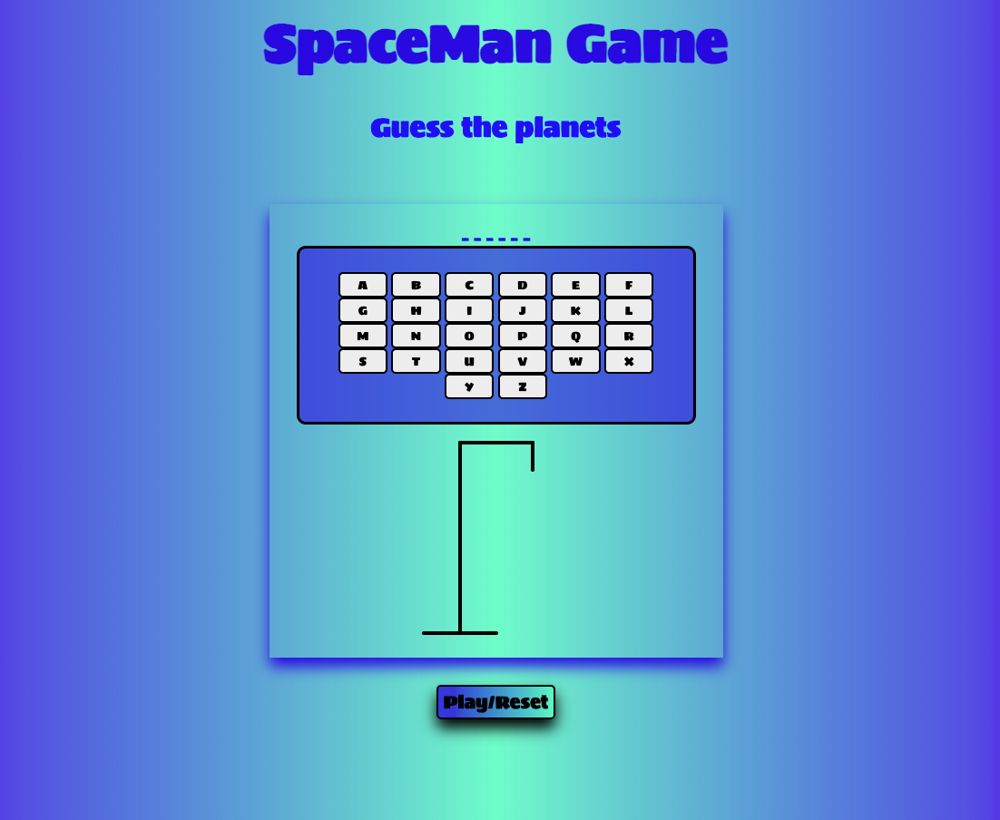
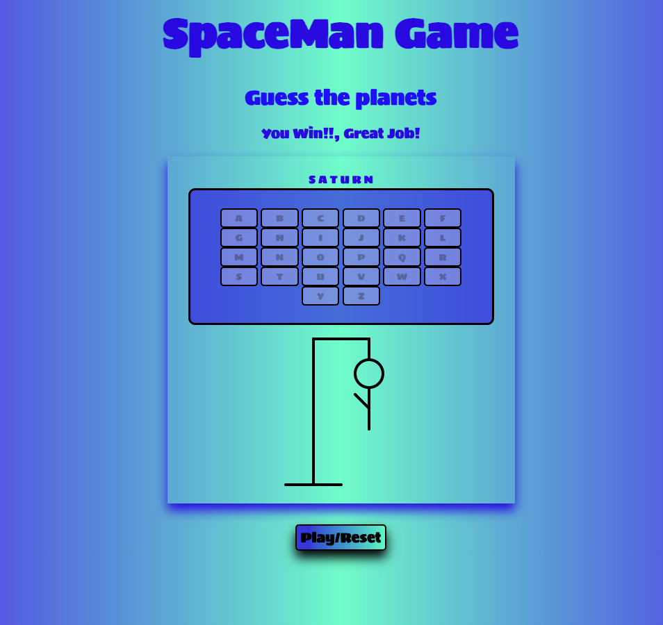
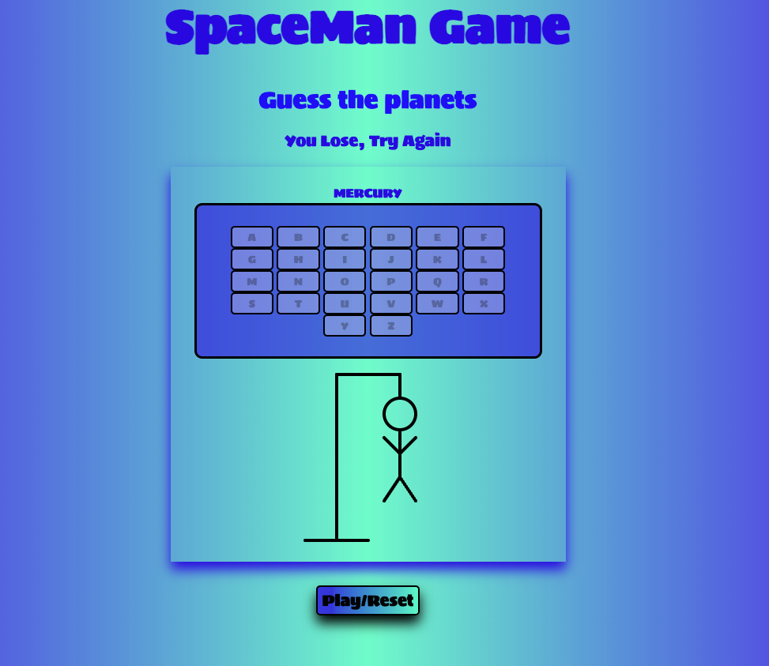

# SpaceMan Game

## Description

Spaceman is a classic word-guessing game where the user typically sees a blank word on the screen, and must guess letters to fill in the blanks.
The user enters their guesses by clicking the letters on the screen. As each letter is guessed, the game checks wether the letter appears in a secret word. If the guessed letter is in the word, all instances of the letter are revealed in the appropriate blanks. If the guessed letter is not in the word, the user is penalized with a body part of the spaceman drawing on the screen. Online spaceman games often have a variety of categories to choose from amd may also include different difficulty levels. Overall, an online hangman game is a fun and convenient way to enjoy this classic game, and it can be played anytime and anywhere as long as there is an internet connection.

## Screenshots

### Initial State

## Winning state

## Loosing State

# Technologies Used
- HTML

- CSS

- JavaScript

# Getting Started

Game access through this link: https://rayjim28.github.io/project-1/

### How to play the game

1. Click the link above.

2. Once in the game now click the letters to guess the hidden word.

3. Enjoy!!.

# Future Add-ons

- Multiple difficulty levels
- Sound effects
- High score tracking
- Extra categories 
- Hints 
- Button to help remove one letter from the alphabet if stuck
- Timer
